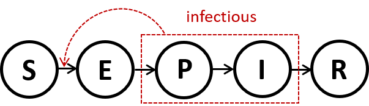

```{r echo = FALSE}
tstamp <- format(Sys.Date(), "%Y%m%d")
```

```{r child='COVID_report_fit.Rmd', eval = FALSE, echo = FALSE}
```


## 주간 COVID-19 $R_t$ 분석 (`r gsub("^0", "", format(Sys.time(), '%d %B %Y'))`)
- 일별 업데이트 되는 $R_t$는 [Rt 계산기](https://kimfinale.shinyapps.io/COVID-19_Reproduction_Number_Korea/) 참조
<!-- ## 개요 -->
- **Susceptible-Exposed-Presymptomatic-Infectious-Removed** 모형
```{r echo=FALSE, out.width="300px", out.height="100px", fig.align='center'}

```

- 모수
  - 평균 잠재기 (latent period, **E -> P**): 3일
  - 평균 잠복기 (incubation period, **E -> P -> I**): 5.2일
  - 증상 발현 후 확진/격리 (**I -> R**): 2.4일
  
- $R_t$ 추정 
  - Particle filtering (sequential Monte Carlo) 방법
  - 일별 확진자수를 잘 설명하는 모수(particle)를 골라냄 (filtering)
  - 추정된 모수는 posterior distribution 의 표본 (1000개)으로 주어짐
  - 그림에서는 median (실선), 50% (짙은색), 95% (옅은색) 구간을 보여줌

---
## 일별 확진자 및 $R_t$ 추정값 
- 일별확진자 (자료 = 회색막대)
```{r echo=FALSE, out.width="400px", out.height="250px", fig.align='center'}
knitr::include_graphics(paste0("plots/daily_confirmed", tstamp, ".png"))
```
- $R_t$
```{r echo=FALSE, out.width="400px", out.height="250px", fig.align='center'}
knitr::include_graphics(paste0("plots/Rt", tstamp, ".png"))
```

---
class: 10px-font
## $R_t$ 추정값
```{r echo=FALSE, message=FALSE}
pr <- c(0.025, 0.25, 0.5, 0.75, 0.975)
suppressWarnings(suppressPackageStartupMessages(library(kableExtra)))
suppressWarnings(suppressPackageStartupMessages(library(data.table)))
suppressWarnings(suppressPackageStartupMessages(library(dplyr)))
pf <- readRDS(paste0("outputs/pf", tstamp, ".rds"))
dat <- readRDS(paste0("outputs/dat", tstamp, ".rds"))

df <- as.data.frame(sapply(pf, function(x) x[,"Rt"]))
Rt_quantile <- as.data.frame(t(apply(df, 1, function(x) quantile(x, pr))))
df <- cbind(Rt_quantile, date = dat[, "date"])
df2 <- df[, c("date", "2.5%", "25%", "50%", "75%", "97.5%")]

data.table::fwrite(df2, paste0("outputs/Rt_estimates", tstamp, ".csv"))

df2 %>%
  tail(n = 7) %>%
  dplyr::relocate(c("date", "2.5%", "25%", "50%", "75%", "97.5%")) %>%
  mutate(across(where(is.numeric), ~ round(., 2))) %>% 
  kbl(row.names = F) %>%
  kable_styling(full_width = F, position = "left")
```

---
```{r echo=FALSE, eval=TRUE}
tstamp <- paste0("_gg", tstamp)
```

## 경기도 일별 확진자 및 $R_t$ 추정값 
- 일별확진자 (자료 = 회색막대)
```{r echo=FALSE, out.width = "400px", out.height = "250px", fig.align = 'center'}
knitr::include_graphics(paste0("plots/daily_confirmed", tstamp, ".png"))
```
- $R_t$
```{r echo=FALSE, out.width="400px", out.height="250px", fig.align='center'}
knitr::include_graphics(paste0("plots/Rt", tstamp, ".png"))
```

---
class: 10px-font
## $R_t$ 추정값
```{r echo=FALSE, message=FALSE}
pr <- c(0.025, 0.25, 0.5, 0.75, 0.975)
suppressWarnings(suppressPackageStartupMessages(library(kableExtra)))
suppressWarnings(suppressPackageStartupMessages(library(data.table)))
suppressWarnings(suppressPackageStartupMessages(library(dplyr)))
pf <- readRDS(paste0("outputs/pf", tstamp, ".rds"))
dat <- readRDS(paste0("outputs/dat", tstamp, ".rds"))

df <- as.data.frame(sapply(pf, function(x) x[,"Rt"]))
Rt_quantile <- as.data.frame(t(apply(df, 1, function(x) quantile(x, pr))))
df <- cbind(Rt_quantile, date = dat[, "date"])
df2 <- df[, c("date", "2.5%", "25%", "50%", "75%", "97.5%")]

data.table::fwrite(df2, paste0("outputs/Rt_estimates", tstamp, ".csv"))

df2 %>%
  tail(n = 7) %>%
  dplyr::relocate(c("date", "2.5%", "25%", "50%", "75%", "97.5%")) %>%
  mutate(across(where(is.numeric), ~ round(., 2))) %>% 
  kbl(row.names = F) %>%
  kable_styling(full_width = F, position = "left")
```


```{r echo=FALSE, eval=FALSE}
# library(pfilter)
devtools::load_all(".")
library(parallel)
library(doParallel)
library(foreach)
tstamp <- "20210314T073222"
dat_ori <- readRDS(paste0( "outputs/dat_ori", tstamp, ".rds"))
dat <- dat_ori[1:(nrow(dat_ori)-1), c("date", "daily_confirmed")]
dat <- dat_ori[date <= as.Date("2021-01-01"), c("date", "daily_confirmed")]
names(dat) <- c("date", "daily_confirm")
y0 <- c(S = 5*1e7, E = 1e1, P = 1e1, I = 1e1, R = 0, CE = 0, CI = 0, CR = 0)
theta["betavol"] <- 0.55
usethis::use_data(y0, overwrite = T)
usethis::use_data(theta, overwrite = T)
devtools::load_all(".")
set.seed(12)

ncores <- detectCores()
cl <- makeCluster(getOption("cl.cores", ncores-2))
doParallel::registerDoParallel(cl)

tic <- Sys.time()
ffbs <- foreach (i = 1:2, .packages = "pfilter", .inorder = F) %dopar% { 
  extract_trace(params = theta, y = y0, data = dat, data_type = "confirmation",
         rep = 1, npart = 2e4, tend = nrow(dat), dt = 0.2, 
         error_pdf = "negbin", negbin_size = 20)
}
Sys.time() - tic

parallel::stopCluster(cl)
```

```{r eval=FALSE, include=FALSE}
df <- as.data.frame(sapply(ffbs, function(x) x[,"Rt"]))
pr <- c(0.025, 0.25, 0.5, 0.75, 0.975)
Rt_quantile <- as.data.frame(t(apply(df, 1, function(x) quantile(x, pr))))
library(data.table)
Rt_mean <- data.frame(mean = rowMeans(df), 
                      rollmean = frollmea(Rt_quantile[,3], n=7))
df <- cbind(Rt_quantile, Rt_mean, dat[, c("date", "daily_confirm")])

ggplot(df, aes(x = date)) +
  geom_ribbon(aes(ymin = `2.5%`, ymax = `97.5%`), fill = "steelblue", alpha = 0.3) +
  geom_ribbon(aes(ymin = `25%`, ymax = `75%`), fill = "steelblue", alpha = 0.6) +
  geom_line(aes(y = `50%`), color = "steelblue", size = 1, linetype = "dotted") + 
  geom_line(aes(y = mean), color = "steelblue", size = 1) + 
  labs(title = "R(t) from particle filtering with backward sampling", y = "R(t)", x = "Day") +
  geom_hline(yintercept = 1, color = "darkred", size = 1, linetype = "dotted") +
  scale_y_continuous(limits = c(0, 10), breaks = c(0, 1, seq(2, 10, 2)), labels = c(0, 1, seq(2, 10, 2))) + 
  scale_x_date(date_breaks = "2 month", date_minor_breaks = "1 month", limits = c(as.Date("2020-01-20"), max(df$date))) +
  labs(x = "", y = "R(t)") 

```


```{r eval=FALSE, echo=FALSE}
## Save ffbs20210101 as a easy-to-use format (list of 9 elements where each element is a matrix where row indicates each time (347 items from 2020-01-20 to 20210-01-10)) and each of 1000 columns indicates a particle
x <- list()
nm <- c("S","E","P","I","R","CE","CI","CR","Rt")
d <- readRDS("outputs/ffbs20210101.rds")
for (i in 1:nrow(d)) {
 x[[i]] <- as.matrix(sapply(d[i,], function(x) x, USE.NAMES = T))
}
names(x) <- nm
# saveRDS(x, "outputs/ffbs20210101.rds")
dat <- readRDS("outputs/dat_ori20210314T073222.rds")
dat <- dat[date <= as.Date("2021-01-01")]
# saveRDS(x, "outputs/dat20210101.rds")

# initial value should be in a data.frame format
res <- readRDS("outputs/ffbs20210101.rds")
n <- nrow(res$S)
y20210101 <- data.frame(S=as.numeric(res$S[n,]), E=res$E[n,], P=res$P[n,], I=res$I[n,],
                        R=res$R[n,], CE=res$CE[n,], CI=res$CI[n,], CR=res$CR[n,]) 
rownames(y20210101) <- NULL
# saveRDS(y20210101, "outputs/y20210101.rds")
```

```{r eval = FALSE, echo = FALSE}
ffbs <- readRDS(paste0( "outputs/ffbs", tstamp, ".rds"))
dat_ori <- readRDS(paste0( "outputs/dat_ori", tstamp, ".rds"))

extract_val <- function(x, i, t) {
  d <- x[i,]
  m <- matrix(unlist(d), ncol=length(d), byrow=F)
  return (m[t,])
}
# extract the values at the final time step
latent_var <- sapply(1:9, function(x) extract_val(ffbs, x, 411))
# run the model at the final point over the posterior distribution
npart <- ncol(ffbs)
days_forward <- 14 # over which prediction will be made
nstatevar <- length(y0) #number of state variables
dt <- 0.2
pred <- array(0, 
                  dim = c(npart, days_forward, nstatevar),
                  dimnames = list(NULL, NULL, names(y0)))

pred[, 1, ] <- latent_var[, 1:8]

for (t in 2:14) {
  pred[, t, ] <- process_model(params = theta,
                                         y = pred[, t-1, ],
                                         tbegin = t-1,
                                         tend = t,
                                         dt = dt,
                                         beta = betas_m)
}
d <- pred[, , 8] # daily_confirm
qnt <- as.data.frame(apply(d, 2, function(x) {quantile(x, pr)}))

betas <- sapply(404:411, function(x) extract_val(ffbs, 9, x))
betas_m <- rowMeans(betas)
```
